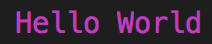

# Colorifylog

Colorifylog is a tool to color your console logs. 

## Usage

Call colorifylog and add a the Hex code.

`const colorifylog("Hello World","#ff00ff")`

Returns

## Name

It was originally called colorify, but since it was a pretty shitty version of its aspiration and the countless other console coloring libraries out there. It has therefore been named colorifylog, as a temporary name.

## Colors

 `Green, Hex: #008000`
 `Red, Hex: #ff0000`
 `Yellow, Hex: #ffff00`
 `Blue, Hex: #0000ff`
 `Magenta, Hex: #ff00ff`
 `Cyan, Hex: #00ffff`

## Contributions welcome

Please add colors, improve functionality.

Here is some things you can do:
* Add background color support
* Add text formatting support
* Support color names instead of hex codes
* Improve main functionality to return instead of directly logging